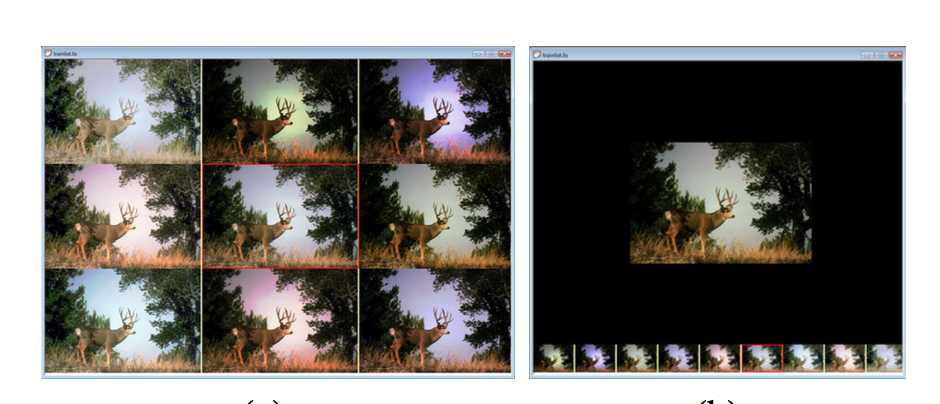
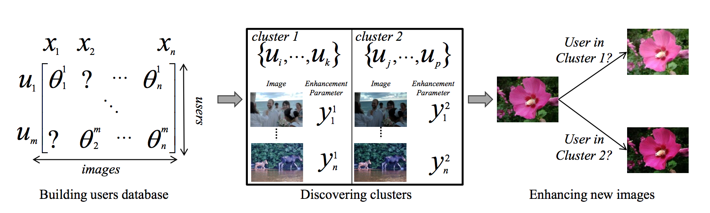
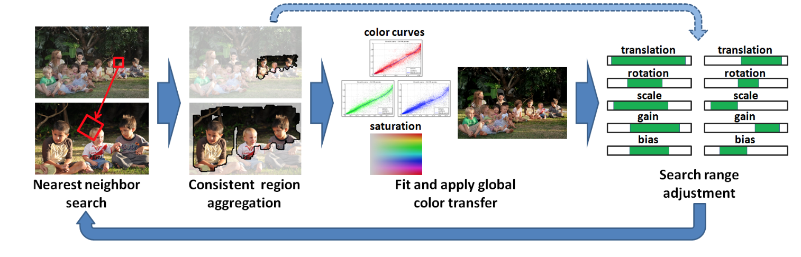

# Survey on Reference Enhancement

##  Personal Photo Enhancement Using Example Images

2010 TOG, NEEL JOSHI Microsoft Research WOJCIECH MATUSIK Disney Research EDWARD H. ADELSON MIT CSAIL and  DAVID J. KRIEGMAN University of California, San Diego

### Enhancement:

 *  global image corrections
 	*  image deblurring 
 	*  exposure and color correction
 *  face-specific enhancements
 	*  like **Liu [2007]**
 	*  >> The aligned, intrinsic prior layers are used directly for a patch- based method, and we also create eigenspaces for these layers.

### Overview:

 1. Automatically detect faces on target images and prior images. 
 2. Align and segment faces in target and prior images.
 3. Decompose images into color, texture, and lighting layers. 
 4. Perform global image corrections.
 5. Perform face-specific enhancements.

##  Personalization of Image Enhancement

2010 CVPR, Sing Bing Kang, Ashish Kapoor, Dani Lishchinski [PDF](http://research.microsoft.com/en-us/um/people/akapoor/papers/personalizedenhancement-cvpr2010.pdf)

Incorporating user preference in automatic image enhancement
Filters:

##  Collaborative Personalization of Image Enhancement

2011 CVPR, Juan C. Caicedo, Ashish Kapoor, **Sing Bing Kang** [PDF](http://research.microsoft.com/en-us/um/people/akapoor/papers/cvpr%202011a.pdf)

User identity and User preferences --> image enhancement

Collaborative filtering --> recommender systems

## Collaborative Personalization of Image Enhancement
2014 IJCV 
  combine the above two papers

## Content-Aware Automatic Photo Enhancement
2012 CG
Liad Kaufman Dani Lischinski Michael Werman

##  Face Hallucination on Personal Photo Albums
2013 ACCV, Yuan Ren Loke, Ping Tan, and Ashraf A. Kassim

* Image selectection 
* Image alignment
* face hallucination by MRF 

## Non-Rigid Dense Correspondence with Applications for Image Enhancement
2011 TOG, Yoav HaCohen, Eli Shechtman, Dan B Goldman, Dani Lishchinski
[PDF](http://www.cs.huji.ac.il/~yoavhacohen/nrdc/nrdc.pdf)
Dense Correspondence

compare to SIFT-Flow [Liu, 2008], Generalized PatchMatch (GPM), sparse SIFT correspondence [Lowe 2004]

Correspondence: using a coarse-to-fine scheme using GPM

applications

* local color transfer
* deblurring
* mask transder

##  Deblurring by Example using Dense Correspondence

2013 ICCV, Yoav HaCohen, Eli Shechtman, Dani Lishchinski

using a sharp reference example that contains some shared content with the blurry photo

extend non-rigid dense correspondence (NRDC)

* correspondence for blur kernel estimation and a local prior for deconvolution
* spatially varying blur estimation

##  Deblurring Face Images with Exemplars

2014 ECCV, Jinshan Pan1, Zhe Hu2, Zhixun Su, and Ming-Hsuan Yang
[Project Page](https://eng.ucmerced.edu/people/zhu/ECCV14_facedeblur.html)

**exploit edge**

find best match example --> use its contour as salient edges for kernel estimation

The initial predicted salient edges are from the exemplar image

edge for estimation refer to [Cho 2009](#fast-motion-deblurring)

## Fast Motion Deblurring

2009 SIGGRAPH/TOG, Sunghyun Cho, Seungyong Lee

**exploit edge**

Three steps, coarse-to-fine:

* **prediction**: estimate the image gradients of latent image ( bilateral filtering, shocking filtering, gradient magnitude thresholding)
* **kernel esitmation**
* **deconvolution**

## Two-Phase Kernel Estimation for Robust Motion Deblurring

2010 ECCV, Li Xu, Jiaya Jia [PDF](http://www.cs.cuhk.edu.hk/~leojia/projects/robust_deblur/robust_motion_deblurring.pdf)

**exploit edge**

**strong edges don't always profit kernel estimation**: *the scale of an object is smaller than that of the blur kernel, the edge information could damage kernel estimation*

* phrase one: kernel initialzation --> select edges
* phrase two: ISD-based kernel refinement

## Psf estimation using sharp edge prediction

2008 CVPR, Neel Joshi, Richard Szeliski, David J. Kriegman